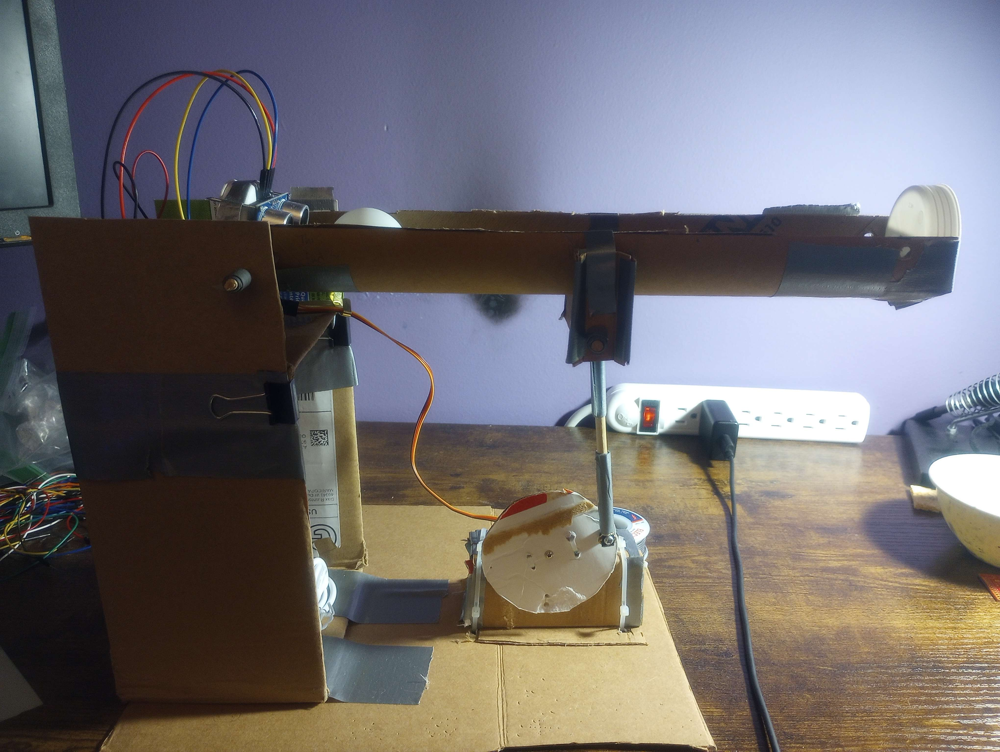
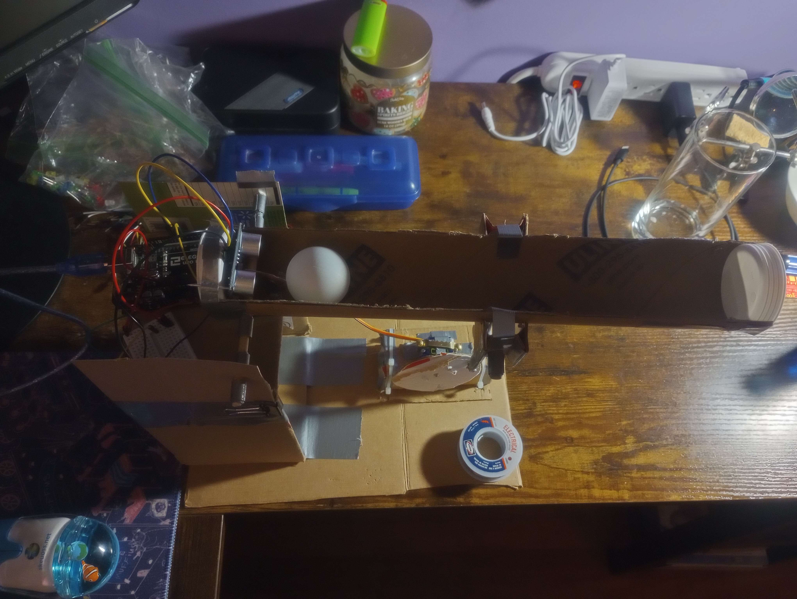
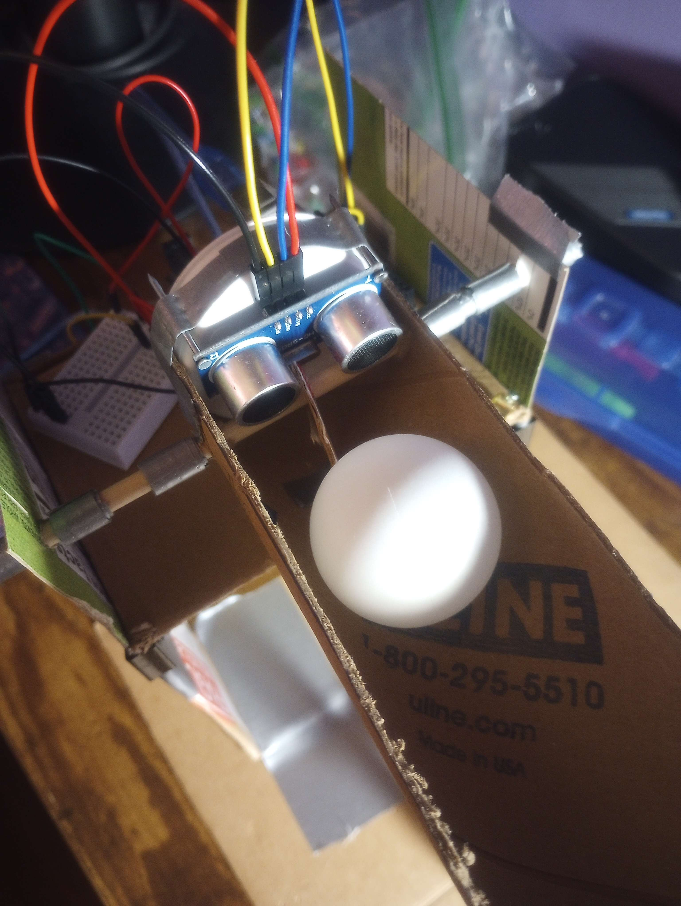
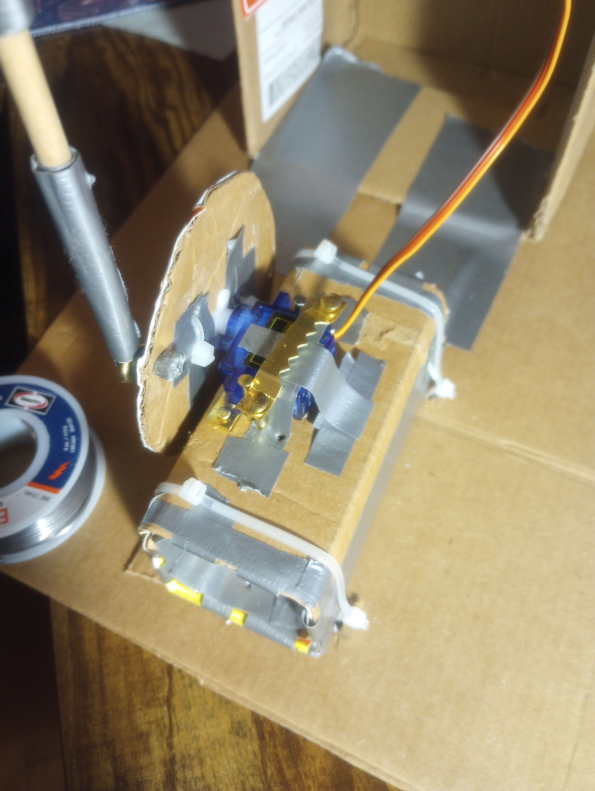
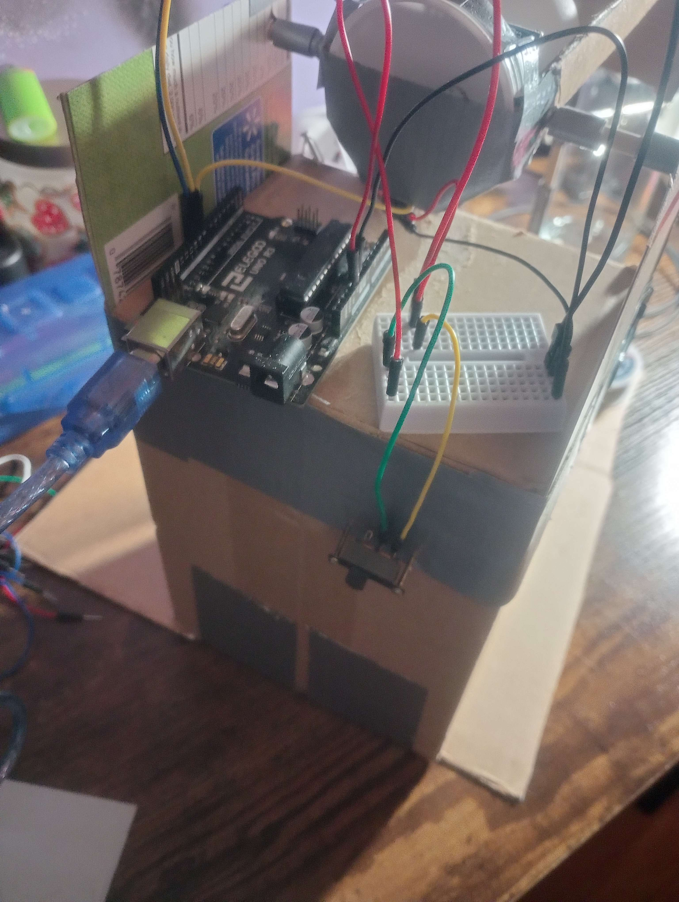

# Single-Axis-Ball-Movement-Control-System
**Goal:** 
- design and implementation of ball balancing controller mechanism.
  
**Concepts Used:** 
- PID Controller
- DSP Filters
- Sensor/Actuator Fusion
- Embedded Programming
  
**Functionality:**
- Ping pong ball moves along tray axis arm via gravity. Movement data from the ball is taken from the ultrasonic sensor, which gets parsed within the microcontorller utilizing a PID control algorithm to determine distance error. This error data gets mapped to the servo motor angle span and allows the servo and arm to act accordingly and allow the ball to react in real-time.

  
**Hardware:**
- Arduino Uno R3
- HC-SR01 Ultrasonic Sensor
- SG90 Servo Motor
- 9V DC Outlet Power Source
- Switch (taken from Tickle-Me Cookie Monster doll and solderd to wires for user interaction)
- Cardboard for structure
- Wooden dowel for arm

## Hardare Setup

